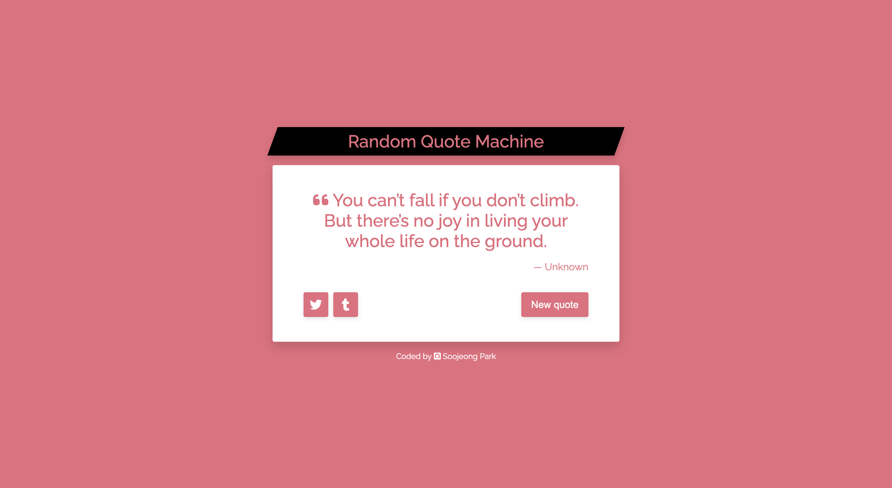

# Random Quote Machine

This is a solution to the [Random Quote Machine Challenge from freeCodeCamp](https://www.freecodecamp.org/learn/front-end-development-libraries/front-end-development-libraries-projects/build-a-random-quote-machine).

## Table of contents

- [Overview](#overview)
  - [The challenge](#the-challenge)
  - [Screenshot](#screenshot)
  - [Links](#links)
- [My process](#my-process)
  - [Built with](#built-with)
  - [Reflection](#reflection)
  - [Useful resources](#useful-resources)
- [Author](#author)

## Overview

### The challenge

Users should be able to:

- Click "New quote" button and see new quote and color theme displayed
- Click SNS share buttons to share the quote, the author of the quote, and hashtag(s) on Twitter or Tumblr

### Screenshot

Desktop:

Mobile:

### Links

[💻 Live Site URL](https://spark-random-quotes.netlify.app/)

## My process

### Built with

- HTML5
- CSS3
- [SASS(SCSS)](https://sass-lang.com/)
- React
- [Vite React boilerplate](https://vitejs.dev/)
- Git
- Mobile-first workflow
- Packages for SASS build process (concat, autoprefixer, postcss-cli, npm-run-all)

### Reflection

This is a project I built as I was practicing using React Context API and useReducer hook. Building a simple app with it made me realize how clean the components can be when the state is managed separately. It was much easier to decide what changes needed to be made to the state depending on the type of action. I'd also like to try using Redux in my next project.

### Useful resources

- [Fetching Data with useReducer](https://www.youtube.com/watch?v=imjfiXxvMD8&list=LL&index=4&t=275s)

## Author

- Twitter - [@codingsooj](https://www.twitter.com/codingsooj)
